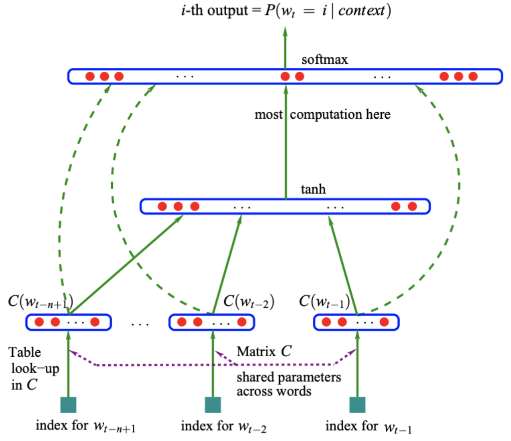

# NNLM

NNLM是指Neural Network Language Model神经网络语言模型，原论文地址为[A Neural Probabilistic Language Model](https://www.jmlr.org/papers/volume3/bengio03a/bengio03a.pdf) .

NNLM是从语言模型出发(即计算概率角度)，构建神经网络针对目标函数对模型进行最优化，训练的起点是使用神经网络去搭建语言模型实现词的预测任务，并且**在优化过程后模型的副产品就是词向量（关键贡献）**。词向量对后面深度学习在自然语言处理方面有很大的贡献，也是获取词的语义特征的有效方法。

## 模型结构

直接通过一个神经网络结构对n元条件概率进行评估，基本结构如下：

**具体任务描述**为：根据来预测$W_{t-n+1}...W_{t-1}$来预测$W_{t}$是什么单词，即用$n-1$个单词来预测第$n$个单词。

## 原理

- 将输入的$n-1$个词的索引转为词向量，每个词向量的维度是m
- 进行这n-1个词向量的拼接，形成一个$(n-1)*m$长度的向量，记做$X$
- 将$X$送进隐藏层，计算$hidden_{out}=tanh(X*H+d)$的到隐藏层的输出。
- 将**隐藏层的输出和输入的词向量同时送入输出层**，计算$y=X*W+hidden_{out}*U+b$,得到输出层$|V|$个节点（$V$是词汇表的大小）的输出，第$i$个节点的输出代表下一个单词是第$i$个单词的概率。概率最大的单词为预测到的单词

